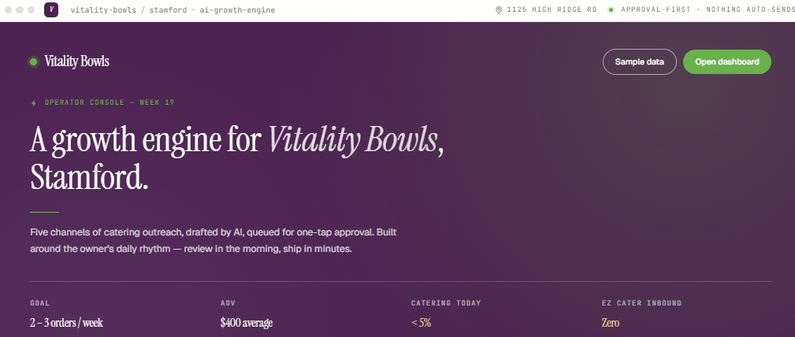
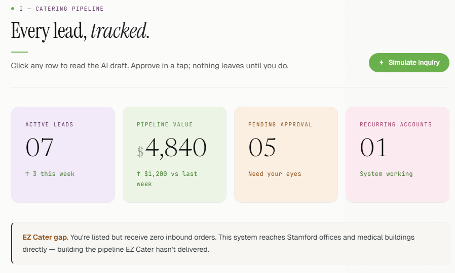
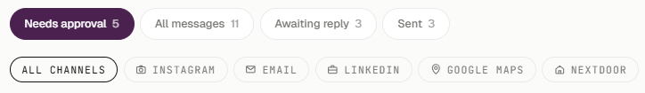
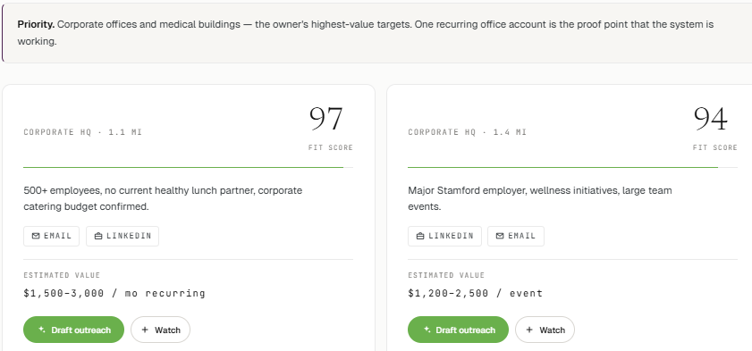
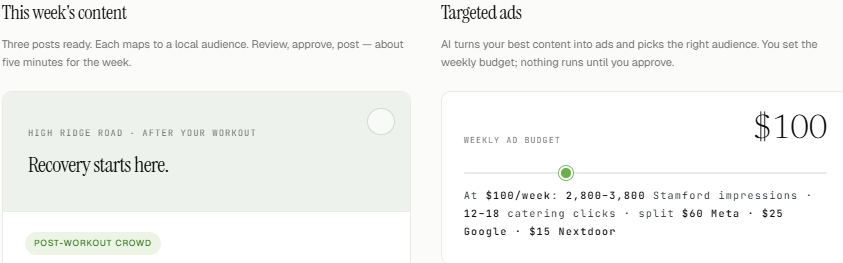
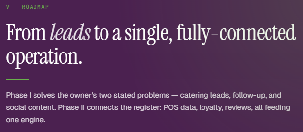

# Vitality Bowls Stamford — AI Growth Engine  
### *TKH AI for Impact: Small Business Challenge · Group 2*

---
# **Table of Contents**

- [Vitality Bowls Stamford — AI Growth Engine](#vitality-bowls-stamford--ai-growth-engine)
    - [*TKH AI for Impact: Small Business Challenge · Group 2*](#tkh-ai-for-impact-small-business-challenge--group-2)
- [**Table of Contents**](#table-of-contents)
  - [The Opportunity](#the-opportunity)
  - [The Approach](#the-approach)
  - [The System](#the-system)
    - [Pipeline — Turning Interest into Orders](#pipeline--turning-interest-into-orders)
    - [Outreach \& Approvals — Simple Weekly Workflow](#outreach--approvals--simple-weekly-workflow)
    - [Prospect Finder — Identifying High-Value Customers](#prospect-finder--identifying-high-value-customers)
    - [Ad \& Content Studio — Consistent, On-Brand Content](#ad--content-studio--consistent-on-brand-content)
    - [Phase 2 Roadmap — Building the Full System](#phase-2-roadmap--building-the-full-system)
  - [The Impact](#the-impact)
  - [AI Components](#ai-components)
  - [How to Run the Demo](#how-to-run-the-demo)
  - [If the File Doesn’t Open](#if-the-file-doesnt-open)
  - [Built By](#built-by)

---

## The Opportunity

Vitality Bowls Stamford has been open for eight months.

They’re located at 1125 High Ridge Road — a strong wellness corridor surrounded by corporate offices, medical centers, gyms, and a steady flow of potential catering customers.

The opportunity is there — especially in catering — but it hasn’t been fully tapped yet.

After bringing marketing back in-house, the focus shifted to day-to-day operations. Catering remains a small portion of revenue, and while inquiries do come in, there isn’t a consistent system to track, follow up, and convert them into repeat business.

> *“If someone doesn’t book on first contact, we likely lose them.”*

This highlighted a clear opportunity:
- Reach the right local customers more consistently  
- Turn initial interest into reliable, repeat catering revenue  

---

## The Approach

We built a lightweight AI growth engine designed to support a busy owner.

    

No marketing team required.  
No complex setup.  
No added workload.

The system is designed around one idea:

> **AI handles the heavy lifting. The owner stays in control.**

Every message, post, and outreach is generated automatically — but nothing goes out without approval.

The entire experience lives in a single HTML file that opens instantly in any browser.

---

## The System

### Pipeline — Turning Interest into Orders

    

Every catering inquiry is captured and organized in one place.

When a new lead comes in:
- AI drafts a personalized response instantly  
- The owner reviews and approves  
- A 4-step follow-up sequence is scheduled automatically  

This creates consistency — every lead is handled, every time.

---

### Outreach & Approvals — Simple Weekly Workflow

    

Outreach across five channels — Instagram, Email, LinkedIn, Google Maps, and Nextdoor — flows into one approval queue.

Each item shows:
- Who it’s going to  
- Why they were selected  
- What will be sent  

The owner can approve, edit, or  it in seconds.

**Estimated time to review everything: ~8 minutes per week.**

---

### Prospect Finder — Identifying High-Value Customers

    

The system scans nearby businesses and highlights strong catering opportunities.

Each prospect includes:
- A relevance score  
- Reasoning behind the selection  
- Estimated value  
- Suggested outreach channels  

Outreach can be drafted instantly and sent to the approval queue.

---

### Ad & Content Studio — Consistent, On-Brand Content

    

Each week, the system generates:
- Social posts tailored to key audiences  
- Captions, hashtags, and CTAs  
- Ready-to-run ads for Meta, Google, and Nextdoor  

A built-in budget slider provides estimated reach and engagement.

Everything is ready to go — pending approval.
** Any visualizations, mockups, inluding but not limited to html code for dashboard demo was created using Claude.ai

---

### Phase 2 Roadmap — Building the Full System

    

Phase 2 begins with strengthening the digital foundation — including a dedicated catering page, conversion tracking, and a centralized way to capture customer data across channels.

From there, the system expands:

- **Toast POS integration** → connects in-store activity to catering opportunities  
- **Incentivio loyalty** → encourages repeat and recurring orders  
- **Ad intelligence** → shifts budget toward what performs best  
- **Review engine** → highlights strong customer feedback as social proof  

Over time, these components connect into a unified system where outreach, conversion, and retention all work together.

---
### Additional Recommendations — Vitality Bowls Stamford Instagram

  
  &nbsp;&nbsp;
  

Beyond the AI dashboard, we created a mockup of simple, high-impact changes to the Vitality Bowls Stamford Instagram account — drawn from examples across other franchises — that can be implemented immediately.

The current [@vitalitybowlsstamford](https://www.instagram.com/vitalitybowlsstamford) profile has an empty biography. Suggested updates include:

- A **Linktree** linking directly to their catering booking page and third-party delivery couriers
- A **detailed bio** with location, hours, and a short brand description to improve discoverability
- **Pinned story highlights** featuring franchise-specific photos and videos for a more polished profile

These changes require no ongoing maintenance and directly support both catering conversions and everyday online visibility.

**Estimated time to implement: ~30 minutes, one time.**

---
## The Impact

The goal is simple and practical:

- 2–3 catering orders per week  
- 1 recurring office account  

Typical order value: **$150–$400**

This system is designed to support that growth while keeping time demands low.

**Estimated time commitment: under 30 minutes per week.**

---

## AI Components

- Natural Language Generation → personalized outreach across multiple channels  
- Prospect Scoring → identifies high-potential local businesses  
- Content Generation → weekly posts tailored to key audiences  
- Automated Follow-Up → structured outreach sequences triggered on approval  
- Ad Generation → campaign creation with targeting and budget guidance  

---

## How to Run the Demo

1. Download `vitality_bowls_v6_minimalist.html` from the `/Code` folder  
2. Open it in a modern browser (Chrome or Safari recommended)  
3. Navigate to the **Pipeline** tab  
4. Click **Simulate New Inquiry**

You’ll see:
- A new lead appear  
- An AI-generated response  
- Approval triggering follow-ups automatically  

---

## If the File Doesn’t Open

If the file doesn’t load correctly:

- Try opening it in **Google Chrome**  
- Ensure the raw file is fully downloaded (not previewed)  
- Right-click → “Open With” → select your browser  
- If needed, re-download the file from the repository  

---

## Built By

**Group 2 — TKH Data Science Technology Fellowship at Synchrony Skills Academy**  
AI for Impact: Small Business Challenge · May 2026  

**Winni · Deborah · Nick · Aminatu · Noah · Dre**
